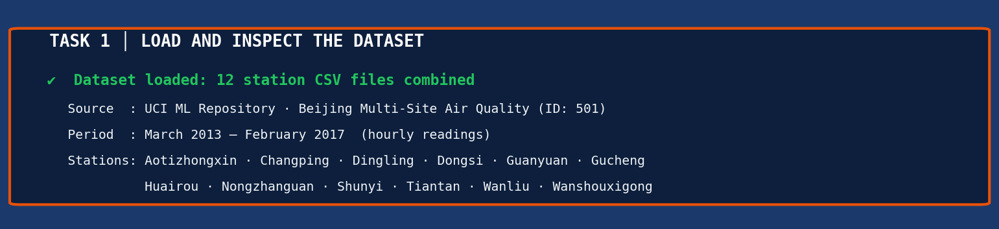
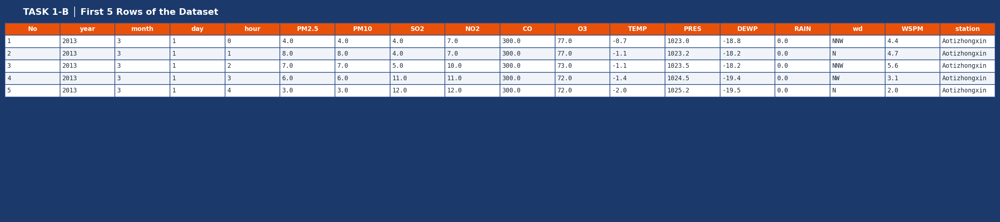
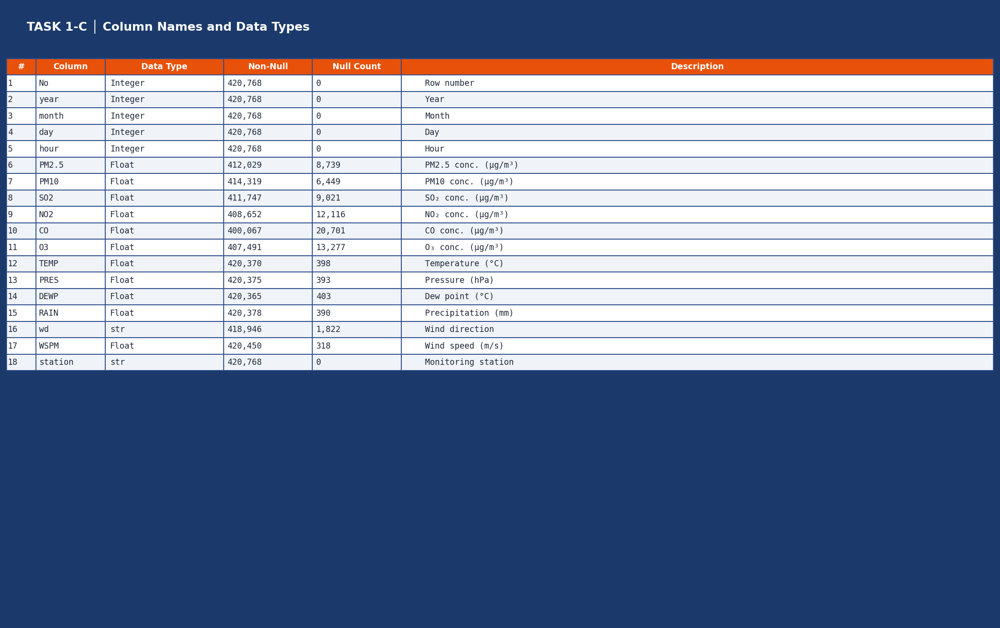
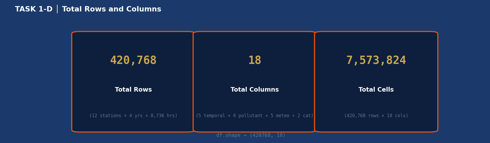
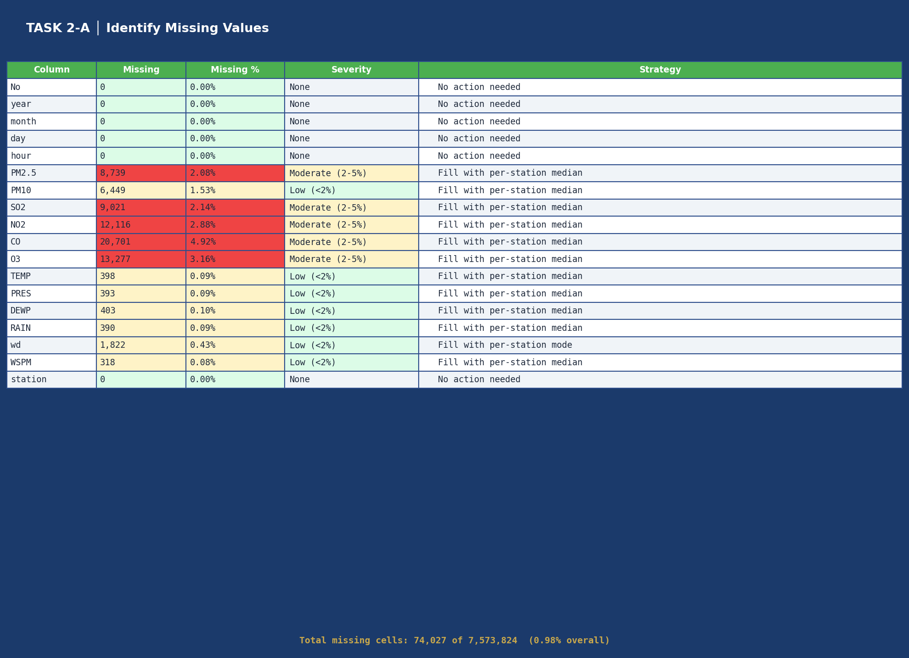
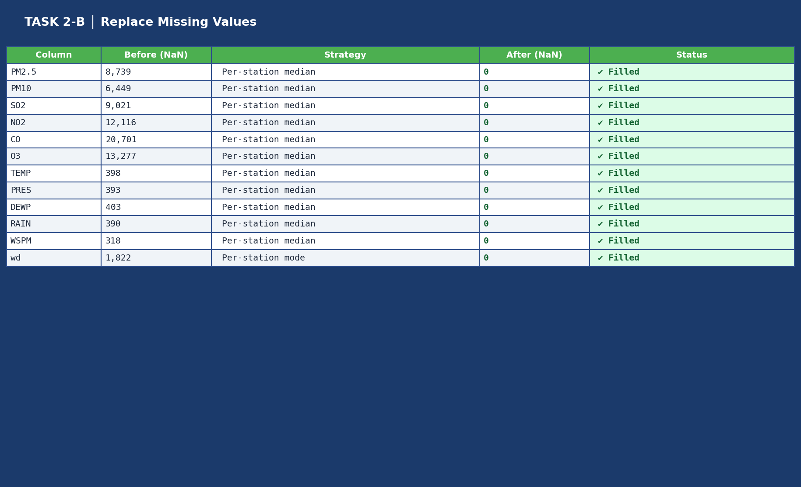
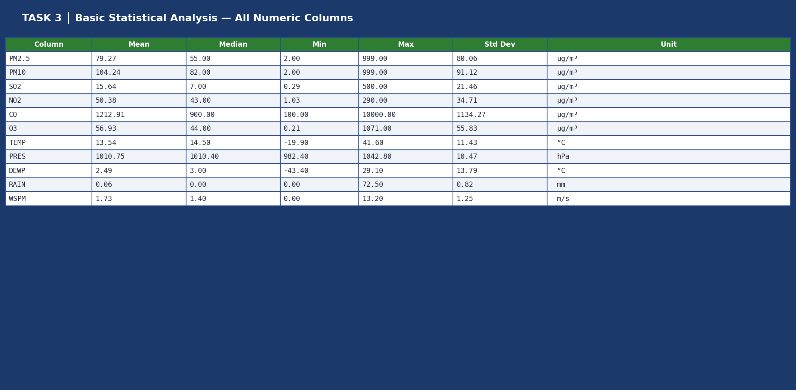
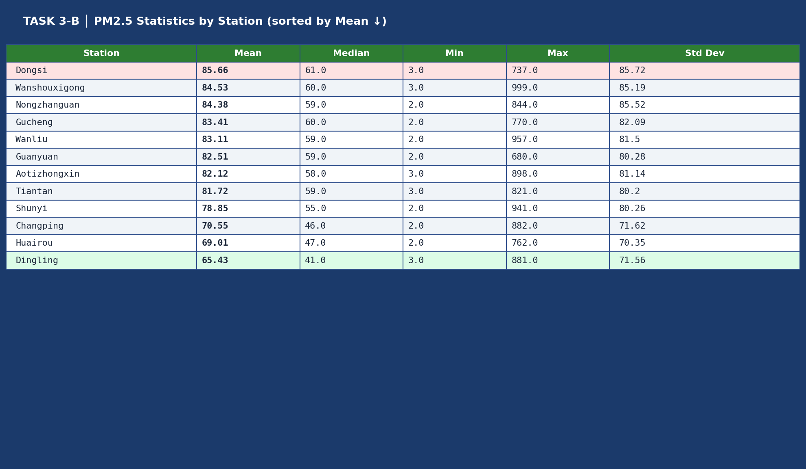
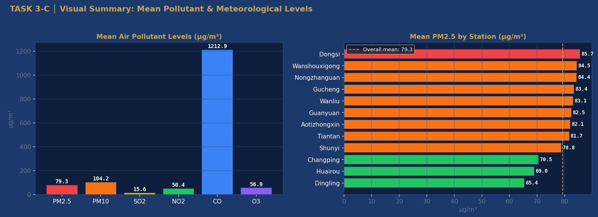

# Week 2 – Activity 1: Beijing Multi-Site Air Quality

**Course:** MSE803  
**Dataset:** [UCI ML Repository – Beijing Multi-Site Air Quality (ID: 501)](https://archive.ics.uci.edu/dataset/501/beijing+multi+site+air+quality+data)

---

## Dataset Description

The Beijing Multi-Site Air Quality Dataset records hourly air quality and weather measurements at 12 monitoring stations across Beijing, from March 2013 to February 2017.

| Property | Value |
|---|---|
| Source | Beijing Municipal Environmental Monitoring Center |
| Period | March 1, 2013 – February 28, 2017 |
| Frequency | Hourly |
| Total Rows | 420,768 |
| Total Columns | 18 |

**12 Stations:** Aotizhongxin, Changping, Dingling, Dongsi, Guanyuan, Gucheng, Huairou, Nongzhanguan, Shunyi, Tiantan, Wanliu, Wanshouxigong

---

## Data Structure

| Category | Columns | Type |
|---|---|---|
| Temporal | No, year, month, day, hour | int64 |
| Air Pollutants | PM2.5, PM10, SO2, NO2, CO, O3 | float64 (µg/m³) |
| Meteorological | TEMP, PRES, DEWP, RAIN, WSPM | float64 |
| Categorical | wd, station | object |

---

## Task 1 – Load and Inspect the Dataset

- Load all 12 station CSV files and combine into one DataFrame
- Display first 5 rows
- Identify column names and data types
- Count total rows and columns

**Result:** 420,768 rows x 18 columns loaded successfully from 12 files.

**Screenshots:**






---

## Task 2 – Data Cleaning

- Total missing values: 74,027 out of 7,573,824 cells (< 1%)
- Numeric columns filled with per-station median
- Wind direction (wd) filled with per-station mode
- No rows dropped — all 420,768 rows retained

**Screenshots:**





---

## Task 3 – Basic Statistical Analysis

- Summary statistics (mean, median, min, max, std dev) for all numeric columns
- PM2.5 breakdown by station sorted by mean concentration

Key finding: Mean PM2.5 of 79.3 µg/m³ is approximately 16 times the WHO annual guideline of 5 µg/m³.

**Screenshots:**





---

## How to Run

```bash
# 1. Download the dataset from UCI and place CSV files in the same folder
#    https://archive.ics.uci.edu/dataset/501/beijing+multi+site+air+quality+data

# 2. Install dependencies
pip install -r requirements.txt

# 3. Run
python all_tasks_beijing.py
```

---

## Dependencies

```
pandas
numpy
matplotlib
```

---

## Citation

Chen, S. (2017). Beijing Multi-Site Air Quality [Dataset]. UCI Machine Learning Repository. https://doi.org/10.24432/C5RK5G
