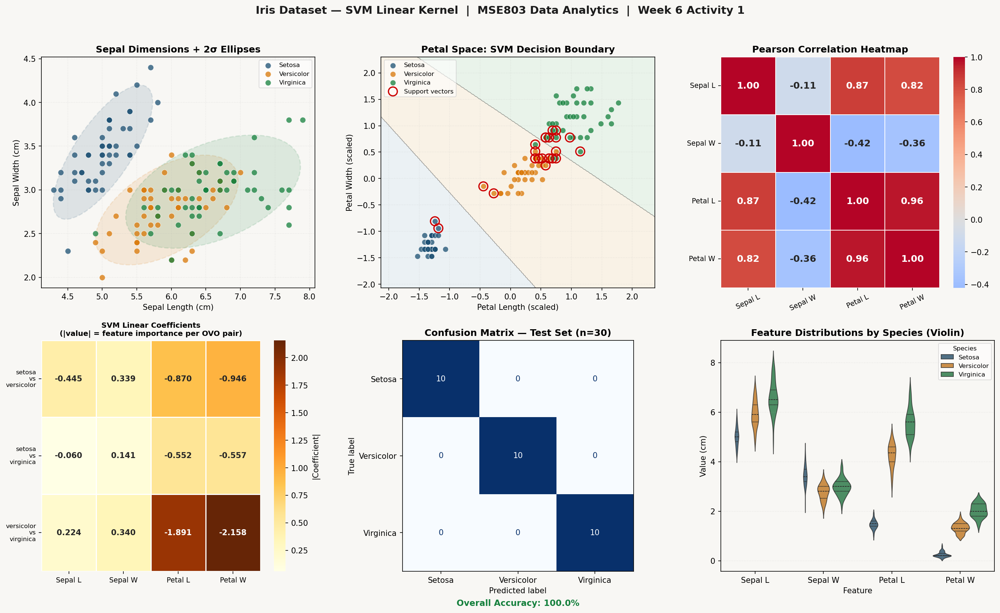

# Week 6 – Activity 1: Iris Dataset — SVM Classification (Linear Kernel)

**Course:** MSE803 Data Analytics | 2511-YCCIA-MSE
**Dataset:** Fisher's Iris Dataset — 150 samples, 4 features, 3 classes

---

## Dataset Overview

| Attribute | Detail |
|---|---|
| Source | UCI Machine Learning Repository |
| Samples | 150 (50 per class) |
| Features | Sepal Length, Sepal Width, Petal Length, Petal Width (cm) |
| Classes | Iris-setosa, Iris-versicolor, Iris-virginica |
| Missing Values | None |
| Duplicate Rows Removed | 3 |

---

## Process

### 1. Data Loading & Cleaning
- Loaded `iris.data` with no header; assigned column names manually
- Verified no missing values across all 6 columns
- Removed 3 duplicate rows (150 → 147 clean samples)

### 2. Preprocessing
- Class labels encoded with `LabelEncoder`
- All 4 features scaled using `StandardScaler` — required for SVM to compute distances fairly
- Stratified 80/20 train/test split → **117 training, 30 test samples**

### 3. SVM — Linear Kernel
- `SVC(kernel='linear', C=1.0, random_state=42)`
- Trained on scaled training set, evaluated on held-out test set

---

## Evaluation Metrics — Test Set (n = 30)

| Class | Precision | Recall | F1-Score | Support |
|---|---|---|---|---|
| Iris-setosa | 1.00 | 1.00 | 1.00 | 10 |
| Iris-versicolor | 1.00 | 1.00 | 1.00 | 10 |
| Iris-virginica | 1.00 | 1.00 | 1.00 | 10 |
| **Overall Accuracy** | | | **1.00 (100%)** | 30 |

### Confusion Matrix
```
              Predicted
              setosa  versicolor  virginica
Actual setosa    10       0           0
    versicolor    0      10           0
     virginica    0       0          10
```
Zero misclassifications across all 3 classes.

---

## Visualisations



Six-panel output:

| Panel | Description |
|---|---|
| Sepal Dimensions + 2σ Ellipses | Scatter plot of sepal features with 2-standard-deviation covariance ellipses per class |
| Petal Space: SVM Decision Boundary | Linear decision regions from a 2-D SVM (petal features), support vectors highlighted in red |
| Pearson Correlation Heatmap | Correlation matrix of all 4 features — petal length/width strongly correlated (r = 0.96) |
| SVM Linear Coefficients | Heatmap of `coef_` magnitudes per OVO pair — shows which features drive each class boundary |
| Confusion Matrix | Perfect 10/10 per class on test set |
| Violin Plot | Distribution of all 4 features across species, showing petal features are most discriminative |

---

## Files

| File | Description |
|---|---|
| `iris.data` | Raw dataset |
| `week6_activity1_iris_svm.py` | Full Python script |
| `week6_activity1_results.png` | Six-panel visualisation output |
| `README.md` | This file |

---

## Key Findings

- The SVM linear kernel achieves **100% test accuracy** on this dataset
- **Petal length and petal width** are the most discriminative features (largest SVM coefficients for versicolor vs virginica boundary)
- Iris-setosa is perfectly linearly separable from the other two classes (clear gap visible in petal scatter)
- Petal length and petal width are highly correlated (r = 0.96), while sepal width shows near-zero correlation with the petal features
- The 2σ confidence ellipses confirm that setosa does not overlap with the other two classes in sepal space
