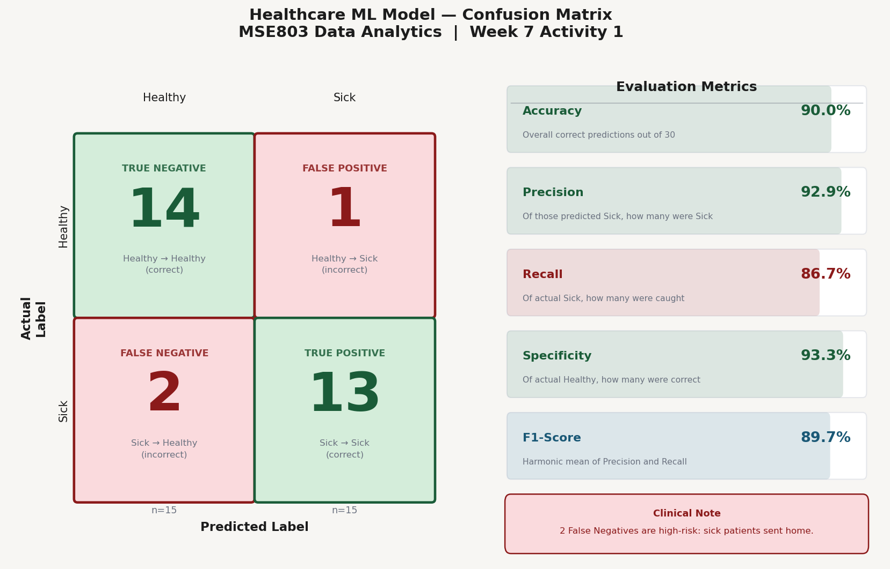

# Week 7 – Activity 1: Healthcare ML Model — Confusion Matrix

**Course:** MSE803 Data Analytics | 2511-YCCIA-MSE
**Task:** Evaluate a binary classification model (Healthy / Sick) using a confusion matrix and key metrics

---

## Dataset Overview

| Attribute | Detail |
|---|---|
| Total records | 100 patient records |
| Training set | 70 records |
| Test set | 30 records (15 Healthy, 15 Sick) |
| Classes | Healthy (Negative), Sick (Positive) |

---

## Confusion Matrix

|  | Predicted Healthy | Predicted Sick |
|---|---|---|
| **Actual Healthy** | TN = 14 | FP = 1 |
| **Actual Sick** | FN = 2 | TP = 13 |

- **3 misclassifications** total: 2 False Negatives, 1 False Positive

---

## Evaluation Metrics — Test Set (n = 30)

| Metric | Value | Formula |
|---|---|---|
| Accuracy | 90.0% | (TP + TN) / total |
| Precision | 92.9% | TP / (TP + FP) |
| Recall (Sensitivity) | 86.7% | TP / (TP + FN) |
| Specificity | 93.3% | TN / (TN + FP) |
| F1-Score | 89.7% | 2 × (Precision × Recall) / (Precision + Recall) |

---

## Clinical Interpretation

- The model achieves **90% overall accuracy** on the held-out test set
- **2 False Negatives** are the highest clinical risk: sick patients were sent home undiagnosed
- **1 False Positive**: a healthy patient flagged as sick — less dangerous but increases unnecessary treatment
- **Recall of 86.7%** means 1 in 8 sick patients is missed — in a healthcare context, maximising recall is the priority
- Adjusting the classification threshold downward would increase recall at the cost of more false positives

---

## Visualisation

Left panel: colour-coded confusion matrix (green = correct, red = incorrect)
Right panel: progress-bar metric display with clinical note

---

## Files

| File | Description |
|---|---|
| `week7_activity1_confusion_matrix.py` | Python script — confusion matrix + metrics visualisation |
| `week7_activity1_confusion_matrix.png` | Output figure |
| `README.md` | This file |
